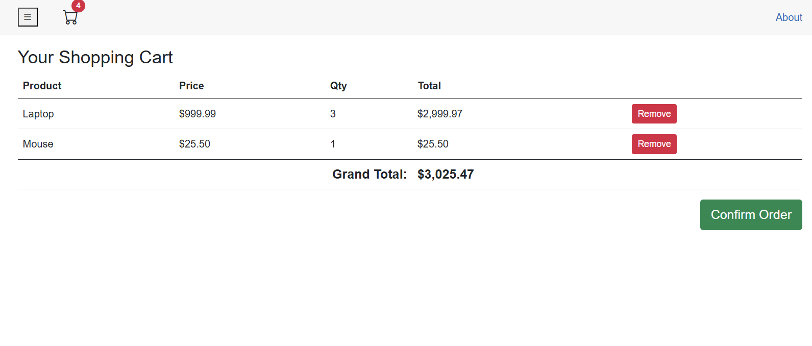
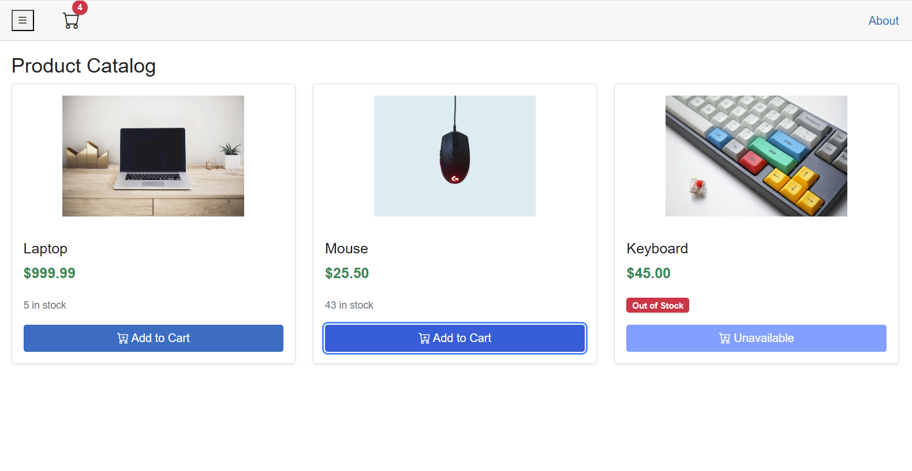
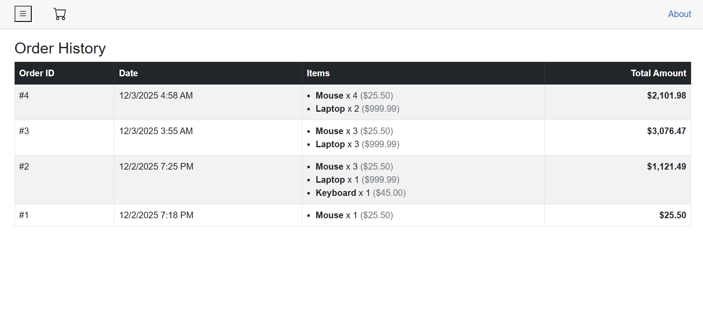
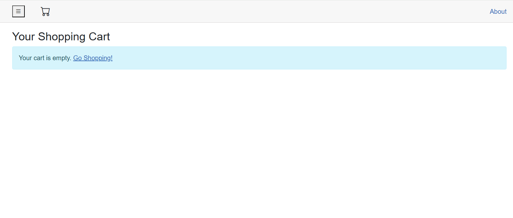

## Blazor Shopping Cart
Accounting Module: A complete Double-Entry system with Journals, Ledgers, Trial Balances, and File Attachments using EF Core.
E-Commerce Module: A persistent Shopping Cart using State Containers and Local Storage, complete with Inventory Management and Toast Notifications.
Architecture: A clean separation of concerns with Client (UI), Server (API), and Shared (Models) projects.
UI/UX: A responsive layout with a toggleable sidebar, dynamic badges, and real-time updates using Cascading Parameters.
<h3>📸 Project Screenshots</h3>

  
  

  
  

